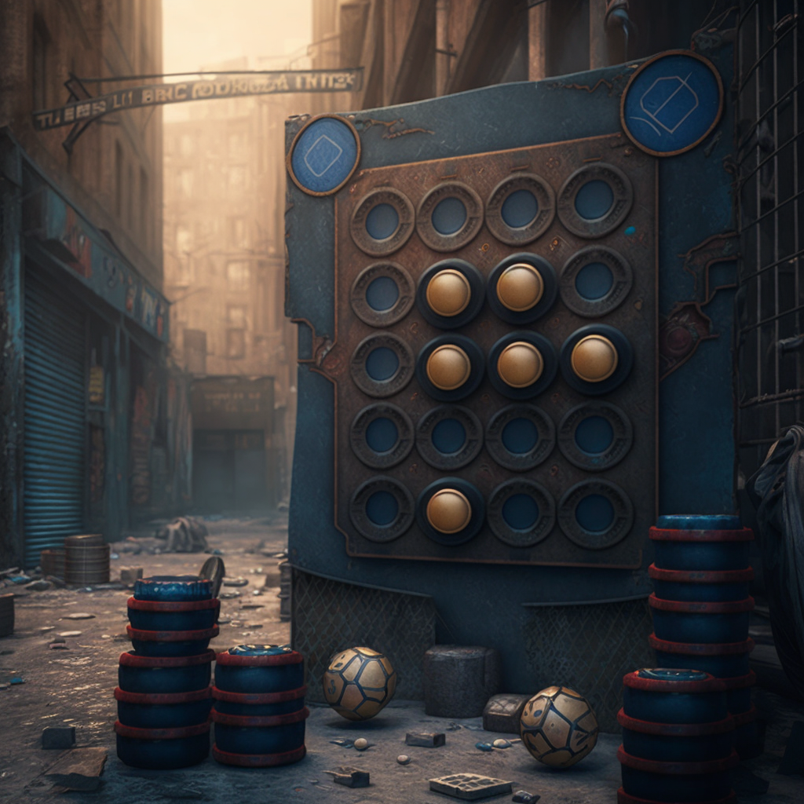

# Object-Oriented Connect Four

This is a version of the classic Connect Four game rebuilt for the browser in HTML, CSS, and JavaScript using an object-oriented design paradigm.

## Key Features

- [x] Game switches between two players
- [x] Players can customize their names and piece colors
- [x] Correctly checks for 4 pieces in a row in all four possible directions after each turn is completed
- [x] Maintains an in-memory matrix array that mirrors the HTML table in the DOM
- [x] "New game" button to start and restart each game

## TODO

- [ ] Animations to show the piece falling down to its final destination
- [ ] CSS design refresh; consider a lightweight CSS framework
- [ ] Light/Dark mode
- [ ] Mobile responsive layout
- [ ] Create a ComputerPlayer to enable solo play
- [ ] Allow for more than two players
- [ ] Allow user to set the size of the board